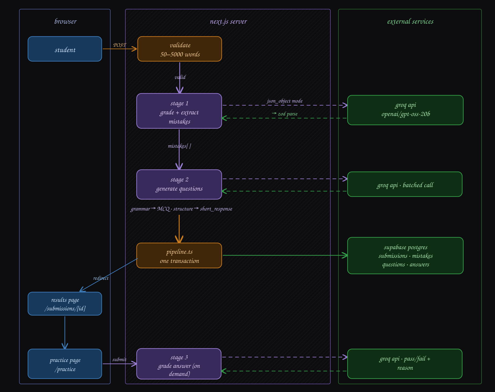

# Lexora AI

**Live:** https://lexora--ai.vercel.app

Student pastes an essay -> Lexora AI flags mistakes with exact quotes -> generates personalized practice questions from those mistakes.
Teachers can batch-submit a whole class and query the aggregated mistake patterns in plain English.

---

## Stack
Next.js 15 (App Router) · React 19 · TypeScript · PostgreSQL (Supabase) · Groq

---

## Pipeline

```
essay text
  → [Stage 1] grade + extract mistakes  (1 Groq call)
  → [Stage 2] group by category + generate questions  (1 batched Groq call)
  → persist in one DB transaction
  → results page → practice page
  → [Stage 3] grade short-response answers on demand  (1 Groq call per answer)
  → [Stage 4] answer free-text questions over aggregated class data
```

Grammar categories → MCQ. Structure/argument categories → short written response. This routing is deterministic in application code — the model never decides it.

---

## Architecture Design



---

## Decisions worth explaining

**One call per stage, not one big prompt.** A single prompt doing everything produces unreliable structured output. Splitting gives each call a narrow schema, isolated failures, and easier prompt tuning.

**Zod at every AI boundary.** Groq's `json_object` mode is not schema-validated. Every response is `unknown` until it passes `.safeParse()`. Types are inferred from schemas with `z.infer<>` — no hand-written parallel types that can drift.

**Fixed 8-category enum.** Categories live as a Postgres check constraint, a TS literal union, and an explicit prompt instruction simultaneously. Makes aggregation trivial and rules out schema drift. Tradeoff: a real mistake outside the 8 goes unflagged.

**Questions grouped by category, not per mistake instance.** Three comma splices → 1-2 representative questions, not 3 identical ones. Grouping is pure app logic before Stage 2.

**Feedback not a grade.** Lexora AI gives formative feedback; final grading remains a human decision both pedagogically and, in some jurisdictions, legally.

**Client components receive narrowed views, never database rows.** Props passed to a client component are serialized into the RSC payload and are readable in page source. `PracticeQuestionView` exists so `model_answer_notes` never crosses the boundary, and an unanswered question does not carry its own answer key.

**Grading reads from the database, not the request.** Both practice actions look the question up by id server-side rather than trusting posted values, so correctness is never a client-supplied claim.

**Session ids are validated, not just present.** The id goes straight into Postgres `uuid` columns, so a malformed cookie is replaced rather than passed through.

---

## Problems hit

- `llama-3.3-70b-versatile` doesn't support `json_schema` mode, only `json_object` — so Zod is the actual validation gate, not the API
- Supabase typed client silently degrades to `never` with `interface` row types — fixed by switching to `type` aliases
- Stage 1 occasionally returns hallucinated category names — dropped server-side before DB insert, never crash the pipeline
- Model sometimes paraphrases instead of exact-quoting — logged, not fatal
- A `'use server'` module turns **every** export into a server-action reference, so an exported `const` arrives on the client as a function. Initial form-state objects therefore live in their own modules (`*-state.ts`), not alongside the actions.
- A cookie set on a middleware *response* is not visible to the same request's Server Components, so the session id is also forwarded on a request header.

---

## Not here (deliberately)
File upload · Auth · Rate limiting · Numeric grades
